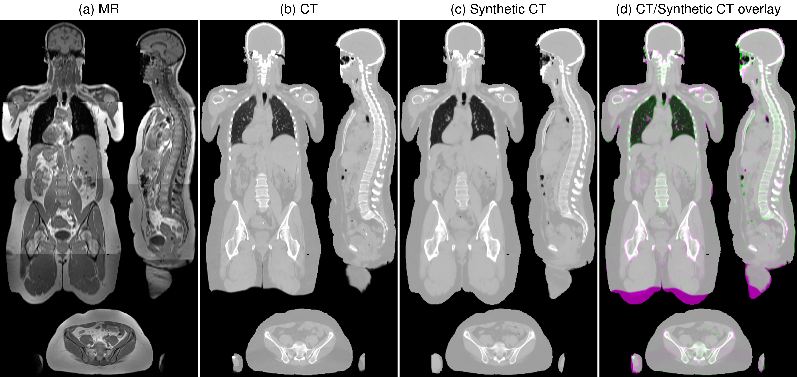

# PixelPort

Whole-body MR-to-CT synthesis with a single 3D U-Net.



## Install

```bash
pip install -r requirements.txt
```

Trained weights are in `weights/`.

## Run

```bash
python infer.py --mri mri.nii.gz
python infer.py --mri mri.nii.gz --mask mask.nii.gz --save_dir out/ --preview
```

Writes `<mri_name>_sct.nii.gz` with the input MRI's affine.

The model was trained on 1.5 mm isotropic MRIs; resample to that spacing for best results.

Any orientation is fine (reoriented to RAS internally).

## Options

| Flag | Description | Default |
|------|-------------|---------|
| `--mri` | input MRI (`.nii` or `.nii.gz`) | **required** |
| `--mask` | body mask NIfTI; applied to the input MRI and the output CT | off |
| `--checkpoint` | trained checkpoint `.pt` | `weights/unet_translator.pt` |
| `--patch_size` | sliding-window size | 256 |
| `--save_dir` | output directory | the MRI's directory |
| `--preview` | also save a PNG of the 3 orthogonal mid-slice views | off |

Device auto-selects CUDA (fp16) else CPU (fp32).

The default 256³ sliding window needs ~21 GB of GPU
memory; lower `--patch_size` (e.g. 128, ~3 GB) for smaller GPUs at a cost in accuracy.

## Acknowledgement

`network.py` is adapted from [anatomix](https://github.com/neel-dey/anatomix) (MIT License).
